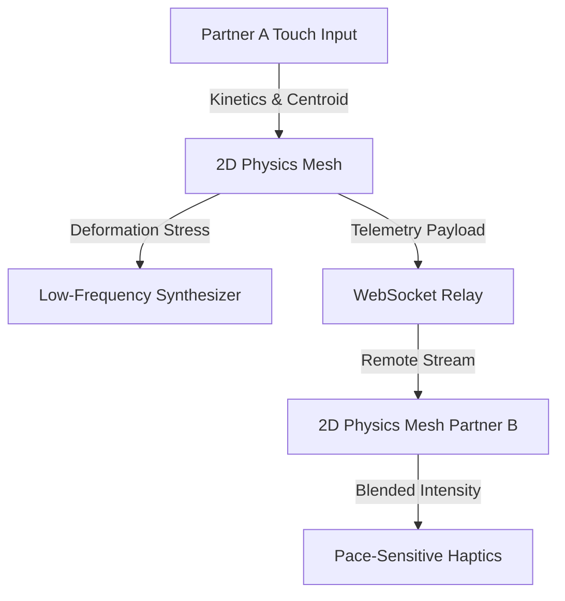
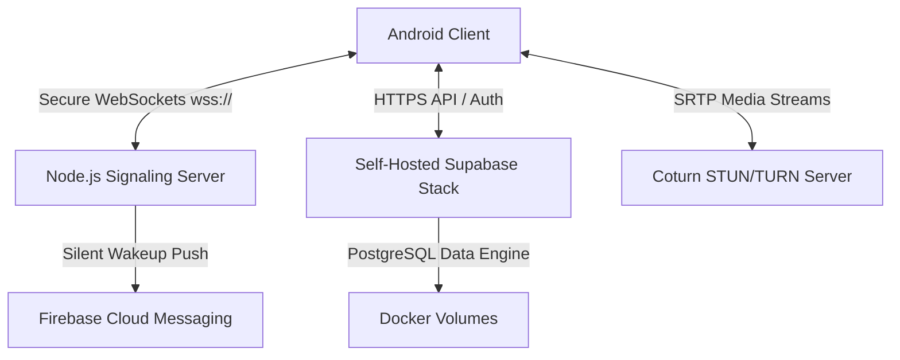

# Enclave: Intimate Private Communication Ecosystem

<div align="center">
  
  <h3>A self-hosted, zero-knowledge, hardware-accelerated private communication platform built for couples.</h3>
  <p>Targeting Android 14+ (API 34) and decentralized, self-hosted Docker architectures.</p>
</div>

---

## 🌟 Hero Overview

**Enclave** is an elite private communications ecosystem designed for individuals who demand complete cryptographic sovereignty and intimate connectivity. By combining an Android 14+ client featuring Jetpack Compose with a self-hosted, Dockerized backend stack (Supabase, Coturn STUN/TURN, and a Node.js WebSocket signaling engine), Enclave eliminates the middleman. Your conversations, media, and keys never touch third-party cloud infrastructure—you own the keys, the server, and the database.

---

## ⚡ Core Feature Dictionary

Here is a detailed guide to Enclave's feature catalog, explaining what they do and how to use them:

### 💬 E2EE Chat (1-on-1 Messages)
* **What it is**: Cryptographically secure messaging where only you and your partner can read the messages. Not even the database owner can see the contents.
* **How to use it**: Tap on your partner's name from the home lounge to open the chat screen. Type your message and tap send. Delivery ticks will show when the message reaches the server (`✓`), their device (`✓✓`), and when it is read.
* **Under the hood**: Each session initializes using a **triple Diffie-Hellman handshake (X3DH)** and encrypts individual messages using the **Double Ratchet Algorithm** (similar to Signal).

### 🎙️ Intimate Audio Notes & Voice Memos
* **What it is**: Record and exchange audio messages with a real-time visual waveform preview.
* **How to use it**: Tap and hold the microphone icon in the chat screen to record. Release to send. Tap the play button on any received audio note to listen.
* **Under the hood**: Encrypted audio attachments are processed as in-memory byte streams and securely uploaded to private Supabase storage buckets.

### 🎨 Shared Interactive Canvas
* **What it is**: A real-time whiteboard canvas where you can draw sketches together in real-time.
* **How to use it**: Open the canvas screen from the chat menu. Start drawing with your finger. Your partner will see your strokes appear live on their screen.
* **Under the hood**: Transmits vector coordinate batches via WebSockets with a 16ms throttle to ensure fluid 60 FPS drawing.

### 🏡 Lounge & Status Stories
* **What it is**: A shared dashboard showing your partner's active connection status, current mood, and temporary stories.
* **How to use it**: Tap the Lounge tab to see your partner's status. Press the "+" button next to your avatar to add a story (photo or text) that expires after 24 hours.
* **Under the hood**: Leverages Supabase realtime listeners to stream database row state changes instantly.

### 🔐 Zero-Knowledge Backups & Vault
* **What it is**: A secure storage vault for private photos and notes, plus encrypted backups of chat history.
* **How to use it**: Go to Settings -> Backup & Vault. Secure the section with your biometric fingerprint or password. You can export a secure backup file containing all keys and histories.
* **Under the hood**: The backup payload is encrypted locally using AES-256-GCM. The encryption key is derived using PBKDF2 from a master passphrase only you know.

---

## 💋 The Kiss Simulator & Intimate Interaction Workflow

The **Kiss Simulator** is Enclave's signature interaction module, designed to create a sense of physical presence over long distances. It combines physical soft-body simulation, real-time audio, and synchronous haptic feedback.



### 1. The 2D Soft-Body Spring Physics Mesh
When you open the Kiss Simulator, a graphic representing a soft-body mouth is rendered. This graphic is not static—it is a physical model consisting of points (vertices) connected by elastic springs (edges):
* **Hooke's Law Anchors**: Every point is tethered to its resting position. When you touch it, it stretches; when you let go, it snaps back.
* **Multi-Touch Repulsion**: Your fingers act as physical magnets that push the mouth shape away. The app reads Android's advanced multi-touch telemetry (the ellipse footprint, touch pressure, and contact angle) to deform the shape in real-time.
* **Gravity Sag**: Tilting your phone shifts the gravity vector. The mouth sags and moves slightly in the direction you tilt the device, creating a tactile weight.

### 2. ASMR Whisper Mode (Intimate Audio)
Simultaneous with the physical interaction is a low-latency WebRTC voice link designed specifically for whispering and close-range sounds:
* **Bypassing Audio Filters**: Standard mobile phone calls use aggressive filters (Echo Cancellation, Noise Suppression, and Automatic Gain Control) to block background noise. Bypassing these filters allows the simulator to stream raw, uncompressed audio—allowing you to hear delicate sounds like breathing, sighs, and soft whispers.
* **Earpiece Routing**: By default, playout is routed through the phone's physical earpiece receiver. Hold the device to your ear or face to listen, maintaining privacy in public settings.

### 3. Audio-Tactile Synthesis & Mutual Press Sync
Touch kinetics translate into sound and vibration:
* **The Synthesizer**: The physical mesh continuously calculates its `Kinetic Energy` (speed of movement) and `Mesh Stress` (how deformed the springs are). A built-in synthesizer maps kinetic energy to volume and mesh stress to sub-bass pitch, creating a warm, humming sound as you touch it.
* **Mutual Touch Detection**: When both you and your partner touch the canvas at the same time, the system enters the **Mutual Press** state.
* **Personalized Heartbeat**: Once synchronized, both devices run a haptic loop that plays a vibration pattern. The pattern's frequency and rhythm blend your touch pressure with your partner's moving averages, generating a tactile pulse unique to the way you touch each other.

### 4. Discreet Privacy Signals
To protect your privacy, the simulator uses subtle, hidden alerts:
* When you open the canvas, a `KISS_INVITATION` packet is sent to your partner. If they do not have the app open, they receive a high-priority system notification.
* The notification is disguised: it uses a generic **compass** icon and displays the subtle text: *"Someone is thinking of you... ❤️"* without revealing the sender's identity or the app name.

---

## 🛠️ System Architecture



### Client Architecture (Android)
* **Jetpack Compose UI**: Customized HSL cream-pink/blush color palette, glassmorphism overlays, and micro-animated gestures.
* **Room SQL Database**: High-performance encrypted SQLite databases utilizing Write-Ahead Logging (WAL) and automated PRAGMA full checkpoints.
* **Sensors & Haptics**: Accelerometer-coupled gravity vectors influencing physics mesh, alongside dynamic vibrator frequency mapping.

### Backend Infrastructure
* **Node.js WebSocket Signaling Engine**: Real-time messaging coordinator with client map trackers and keep-alive ping/pong heartbeats.
* **Self-Hosted Supabase Stack**: Local Docker containers running PostgreSQL, Gotrue Authentication, PostgREST, and Realtime listeners.
* **Coturn Media Relay**: Dynamic STUN/TURN service facilitating direct peer connection establishment behind complex NAT environments.

---

## 🚀 Getting Started

> [!IMPORTANT]
> ### Full Step-by-Step Setup Guide
> For detailed instructions on local package dependencies, Docker Compose setup, Nginx proxy configs, Certbot SSL, Coturn, and server scripts, please see the **[SETUP_GUIDE.md](SETUP_GUIDE.md)** manual at the root of the workspace.

### 📦 Quick Start Workspace Prep
1. Clone the repository to your local machine.
2. Initialize example configuration files:
   ```bash
   # Client Configuration
   cp enclave-ui/local.properties.example enclave-ui/local.properties
   
   # Firebase Client Config (Optional, replace with your own google-services.json)
   cp enclave-ui/app/google-services.json.example enclave-ui/app/google-services.json
   
   # Backend Configuration
   cp enclave-server/.env.example enclave-server/.env
   
   # Firebase Admin Config (Optional, replace with your own service account)
   cp enclave-server/signaling-server/firebase-adminsdk.json.example enclave-server/signaling-server/firebase-adminsdk.json
   ```

### 📱 2. Local Android Development
1. Open `enclave-ui/local.properties` and provide the absolute path to your local Android SDK (e.g. `sdk.dir=/home/username/Android/Sdk`).
2. Run the local setup script to spin up the Docker backend and configure development routing:
   ```bash
   chmod +x setup-local.sh
   ./setup-local.sh
   ```
3. Open the `enclave-ui` folder in Android Studio or compile via command-line:
   ```bash
   cd enclave-ui
   ./gradlew assembleDebug
   ```

### ☁️ 3. VPS Server Deployment
For production deployment, you will need a domain name pointed to your VPS (e.g. `api.yourdomain.com` for Supabase and `wss.yourdomain.com` for the Signaling Server).

1. Copy the `enclave-server` folder to your VPS.
2. Edit `/opt/enclave-server/.env` and update the database passwords, JWT secrets, public domains, and SSL certificate paths.
3. Consult the comprehensive **[Setup & Configuration Manual](SETUP_GUIDE.md)** for detailed commands on:
   - Setting up Nginx with Let's Encrypt SSL.
   - Configuring Coturn TURN relay.
   - Setting up PM2 for Node.js signaling persistence.

---

## 🔒 Security Whitelists & Pairing Rules

Enclave is optimized for couples and enforces client-side whitelist constraints to guarantee privacy:
1. **Client-Side Sign-Up Whitelist:** Registering accounts on your self-hosted Supabase instance is restricted to whitelisted emails by default to prevent third-party logins.
2. **Deterministic Peer Lookup:** The pairing logic automatically resolves connection profiles based on the alternate partner (User A always looks for User B, and vice-versa).
3. **Hardening recommendation:** Once both partners have registered, it is highly recommended to disable sign-ups in your Supabase Auth settings to permanently lock down the database.

---

## 🤝 Credits & Reference Projects

Enclave draws inspiration, design paradigms, and architectural foundations from the following excellent open-source projects:

* **[Signal Android](https://github.com/signalapp/Signal-Android.git)**: Reference for Signal-grade E2EE Double Ratchet session handshakes, backup/restore logic, and encrypted database schemas.
* **[Libsignal](https://github.com/signalapp/libsignal.git)**: The cryptographic engine powering E2EE key exchanges, PreKey bundles, identity key signatures, and Session Cipher operations.
* **[Music Player Compose](https://github.com/DawinderGill/MusicPlayer-JetpackCompose.git)**: Inspiration for customized media players and custom in-memory audio waveform rendering.
* **[Camera Samples](https://github.com/android/camera-samples.git)**: Native CameraX integration patterns for recording in-memory secret media and photo capture.
* **[Element X Android](https://github.com/element-hq/element-x-android.git)**: Reference for vector stroke batching, multi-colored UI drawing themes, and Matrix/WebRTC audio-visual calling logic.
* **[Fossify Gallery](https://github.com/FossifyOrg/Gallery.git)**: Reference for media pickers, secure vaults, and custom image viewer/lightbox zoom overlays.

---

## 📄 License
This project is licensed under the GNU AGPLv3 License. See the ([LICENSE](LICENSE)) file for details.