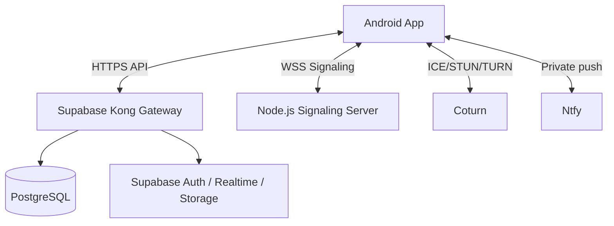

# Enclave

A privacy-first communication ecosystem for couples, with a self-hosted backend and an Android client.

<div align="center">
  
  <p><strong>Android 14+ client · Signal-based E2EE · Self-hosted Supabase + Signaling + TURN</strong></p>
</div>

---

## What Enclave includes

- **`enclave-ui/`**: Kotlin + Jetpack Compose Android app.
- **`enclave-server/`**: Dockerized backend (Supabase stack + Ntfy) and signaling server integration.
- **`enclave-page/`**: Static website/landing page.
- **Root docs**:
  - [`SETUP_GUIDE.md`](SETUP_GUIDE.md): complete local and VPS setup flow.
  - [`REPO_STRUCTURE.md`](REPO_STRUCTURE.md): workspace/file map.

---

## Core features

- **End-to-end encrypted chat** (Signal-style key/session model)
- **Encrypted media sharing**
- **WebRTC calls** via self-hosted signaling + TURN
- **Private vault + backups**
- **Lounge/status experiences** (stories, shared interactions)
- **Self-hosted notifications** through Ntfy

---

## Architecture overview



---

## Quick start (local development)

> Full details: [`SETUP_GUIDE.md`](SETUP_GUIDE.md)

### 1) Prepare config files

```bash
cp enclave-ui/local.properties.example enclave-ui/local.properties
cp enclave-server/.env.example enclave-server/.env
cp enclave-server/signaling-server/firebase-adminsdk.json.example enclave-server/signaling-server/firebase-adminsdk.json
```

Optional (only if you use Firebase services in the Android app):

```bash
cp enclave-ui/app/google-services.json.example enclave-ui/app/google-services.json
```

### 2) Start local backend + apply local defaults

```bash
chmod +x setup-local.sh
./setup-local.sh
```

This script checks Docker, starts the backend stack, verifies health endpoints, and updates local Android endpoints to emulator loopback (`10.0.2.2`).

### 3) Complete Android `local.properties`

`enclave-ui/app/build.gradle.kts` requires these keys to exist:

- `sdk.dir`
- `TURN_SERVER_URL`
- `TURN_USERNAME`
- `TURN_PASSWORD`
- `SIGNALING_SERVER_URL`
- `SUPABASE_URL`
- `SUPABASE_KEY`
- `NTFY_SERVER_URL`
- `NTFY_USERNAME`
- `NTFY_PASSWORD`

### 4) Build app

```bash
cd enclave-ui
./gradlew assembleDebug
```

### 5) Validate signaling server (optional but recommended)

```bash
cd enclave-server/signaling-server
npm install
npm run typecheck
npm run build
```

---

## Production deployment summary

Use [`SETUP_GUIDE.md`](SETUP_GUIDE.md) for full VPS instructions.

High-level flow:

1. Provision Ubuntu VPS and DNS (`api.<domain>`, `wss.<domain>`).
2. Install Docker, Node.js, PM2, Nginx, Certbot, Coturn.
3. Copy `enclave-server/` to VPS and configure `.env`.
4. Start backend with `deploy.sh`.
5. Build/run signaling server with PM2.
6. Configure Nginx TLS reverse proxy and firewall.

---

## Common commands

### Local stack

```bash
# From repo root
./setup-local.sh
```

### Backend stack (manual)

```bash
cd enclave-server
docker compose up -d
docker compose ps
```

### Signaling server

```bash
cd enclave-server/signaling-server
npm install
npm run build
npm start
```

---

## Repository guide

- Setup guide: [`SETUP_GUIDE.md`](SETUP_GUIDE.md)
- Workspace/file map: [`REPO_STRUCTURE.md`](REPO_STRUCTURE.md)
- Landing page source: [`enclave-page/`](enclave-page)

---

## License

Licensed under **GNU AGPLv3**. See [`LICENSE`](LICENSE).
