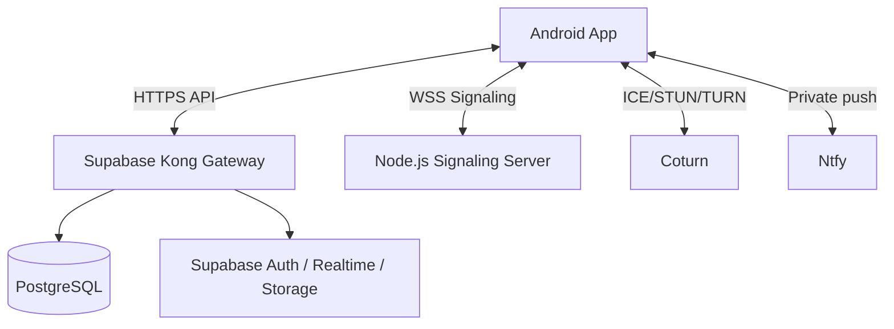

<div align="center">
  
  <h1>Enclave</h1>
  <p><strong>Android 14+ client · Signal-based E2EE · Self-hosted Supabase + Signaling + TURN</strong></p>
  
  [](https://www.gnu.org/licenses/agpl-3.0)
  [](#)
  [](#)
</div>

> [!NOTE]
> A privacy-first communication ecosystem for couples, featuring a self-hosted backend and a specialized Android client. 

---

## 📑 Table of Contents

- [Core Features](#-core-features)
- [Architecture Overview](#-architecture-overview)
- [1-Click Production Deployment (Recommended)](#-1-click-production-deployment-recommended)
- [Local Development Setup](#-local-development-setup)
- [Advanced Production Deployment (Manual)](#-advanced-production-deployment-manual)
- [Troubleshooting & Commands](#-troubleshooting--commands)
- [Credits & Open Source Acknowledgements](#-credits--open-source-acknowledgements)

---

## ⚡ Core Features

- 💬 **End-to-end encrypted chat** (Signal-style key/session model)
- 🖼️ **Encrypted media sharing**
- 📞 **WebRTC calls** via self-hosted signaling + TURN
- 🗃️ **Private vault + backups**
- 🏡 **Lounge/status experiences** (stories, shared interactions)
- 🔔 **Self-hosted notifications** through Ntfy

---

## 📐 Architecture Overview

> [!TIP]
> See the detailed [SYSTEM_ARCHITECTURE.md](docs/SYSTEM_ARCHITECTURE.md) and [REPO_STRUCTURE.md](docs/REPO_STRUCTURE.md) for a deeper dive.



---

## 🚀 1-Click Production Deployment (Recommended)

The easiest way to deploy the entire production backend (Supabase, WebRTC, Ntfy, Nginx, SSL) is using the automated script on a fresh **Ubuntu 22.04 or 24.04** server. 

> [!IMPORTANT]
> Make sure you have your DNS records pointing to your server IP before running this script. Disable Cloudflare proxying (orange cloud).

```bash
curl -fsSL https://enclave.saifmukhtar.dev/install | sudo bash
```

This script will prompt you for your root domain and automatically provision `api.enclave.*`, `wss.enclave.*`, and `ntfy.enclave.*`.

---

## 💻 Local Development Setup

For local testing and Android development without a public domain. Full details are in [`SETUP_GUIDE.md`](docs/SETUP_GUIDE.md).

### 1) Start local backend
```bash
cp apps/android/local.properties.example apps/android/local.properties
cp backend/server/.env.example backend/server/.env
chmod +x scripts/setup-local.sh
./scripts/setup-local.sh
```

### 2) Build Android App
Configure your SDK path in `apps/android/local.properties`, then:
```bash
cd apps/android
./gradlew assembleDebug
```

---

## 🛠️ Advanced Production Deployment (Manual)

> [!WARNING]
> This section is for advanced users who want to manually deploy the stack without the 1-click script.

1. **Provision DNS:** Create A records for `api.enclave.<domain>`, `wss.enclave.<domain>`, `ntfy.enclave.<domain>` pointing to your VPS.
2. **Install Dependencies:** Docker, Node.js, PM2, Nginx, Certbot, Coturn.
3. **Copy Server Files:** `rsync` the `backend/server/` folder to `/opt/enclave-server`.
4. **Configure Secrets:** Manually generate cryptographic keys and populate `/opt/enclave-server/.env`.
5. **Deploy Backend:** Run `docker compose up -d` in the server directory.
6. **Signaling Server:** Run `npm install && npm run build` in `signaling-server/`, then run with PM2.
7. **Nginx & SSL:** Configure Nginx reverse proxies for ports 8000 (API), 8085 (WSS), 2586 (Ntfy) and run Certbot.
8. **Coturn & Firewall:** Update `/etc/turnserver.conf` and open UFW ports (80, 443, 3478, 5349, and UDP 49152:65535).

---

## 🩺 Troubleshooting & Commands

### Common Issues
- **Gradle fails due to missing keys:** Confirm all required `local.properties` keys are present.
- **WebSocket disconnects in production:** Confirm Nginx `Upgrade` + `Connection` headers and timeout settings.
- **TURN not working on mobile data:** Verify Coturn ports and UDP relay range are open in UFW.

### Useful Commands
```bash
# View backend stack
docker compose -f backend/server/docker-compose.yml ps

# Restart signaling server
pm2 restart enclave-signaling

# Renew SSL certificates
certbot renew
```

---

## 👥 Credits & Open Source Acknowledgements

Enclave is built upon the incredible work of the open-source community. We stand on the shoulders of giants.

### Maintainer & Architect
- **Saif Mukhtar** 
  - GitHub: [@saifmukhtar](https://github.com/saifmukhtar)
  - Portfolio: [saifmukhtar.dev](https://saifmukhtar.dev)

### Core Libraries & Technologies
- 🔐 **Signal Protocol** & **Libsignal**: The absolute gold standard for E2EE cryptography.
- 🗄️ **Supabase**: Powering our auth, realtime, and Postgres infrastructure.
- 📡 **WebRTC** & **Coturn**: Enabling seamless, private, high-quality media traversal.
- 🔔 **Ntfy**: Sovereign, self-hosted push notifications.
- 🎨 **Jetpack Compose** & **Element X Android**: Modern UI/UX patterns.
- 📦 **Docker** & **PM2**: Resilient infrastructure deployment.

> **License:** Enclave is proudly licensed under the **GNU AGPLv3**.
