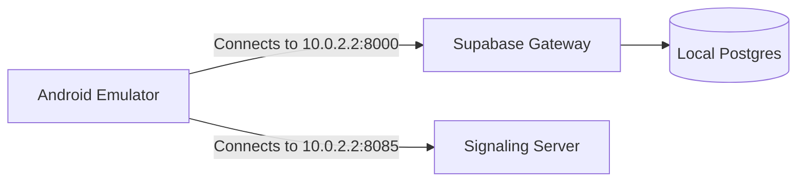

# 🛠️ Enclave Monorepo: Setup & Configuration Manual

This document is the master setup manual for the **Enclave** ecosystem. It covers:
1. **Local Development (No Domain Required)**: Setting up a local development machine using Docker Compose and the Android Emulator loopback.
2. **Production VPS Server Deployment (With Domain Names)**: Hosting the backend infrastructure securely on a standard Ubuntu 24.04 LTS VPS with Nginx, Certbot SSL, Coturn media relays, and PM2 process managers.

---

## 📋 System Requirements & Package Requirements

The following tables outline the packages and runtimes required for the local development workstation and the production cloud VPS.

### Workstation Dependencies (Local Development)
| Component | Minimum Version | Installation Command / Source | Purpose |
| :--- | :--- | :--- | :--- |
| **Android Studio** | Ladybug (2024.2.1)+ | [developer.android.com](https://developer.android.com/studio) | Client compilation & emulation |
| **Java Development Kit (JDK)** | JDK 17 | `sudo apt install openjdk-17-jdk` | Build engine runtime |
| **Docker Engine** | v24.0.0+ | [docs.docker.com/engine/install](https://docs.docker.com/engine/install/) | Runs local database stack |
| **Docker Compose** | v2.20.0+ | Included in Docker Desktop / Plugins | Manages database containers |

### VPS Server Dependencies (Ubuntu 24.04 LTS Production)
| Component | Package / Runtime | Installation Command | Purpose |
| :--- | :--- | :--- | :--- |
| **Docker Engine & Plugin** | `docker-ce`, `docker-compose-plugin` | See Docker engine setup section | Orchestrates Supabase stack |
| **Node.js** | Node.js v20.x | NodeSource PPA & `apt install nodejs` | WebSocket Signaling runner |
| **PM2 Manager** | `pm2` | `sudo npm install -g pm2` | Persistence & auto-restart of Signaling |
| **Nginx** | `nginx` | `sudo apt install nginx` | Reverse Proxy & SSL endpoint wrapper |
| **Certbot** | `certbot`, `python3-certbot-nginx` | `sudo apt install certbot python3-certbot-nginx` | Automatically fetches & renews SSL |
| **Coturn** | `coturn` | `sudo apt install coturn` | WebRTC audio media relay |

---

## 💻 1. Local Development Setup (No Domain Name Required)

For debugging and testing features locally without purchasing a domain, you can run the backend server on your machine and route the Android Emulator to it.



### Step 1: Clone and Prepare Workspace Files
Run the following commands in your workspace root to initialize development configuration templates:
```bash
# 1. Android Client Configurations
cp enclave-ui/local.properties.example enclave-ui/local.properties

# 2. Android Firebase Client Configuration
cp enclave-ui/app/google-services.json.example enclave-ui/app/google-services.json

# 3. Server Configuration
cp enclave-server/.env.example enclave-server/.env

# 4. Firebase Admin SDK Configuration
cp enclave-server/signaling-server/firebase-adminsdk.json.example enclave-server/signaling-server/firebase-adminsdk.json
```

### Step 2: Spin Up the Local Docker Backend
Run the automated setup script. This script will launch the Supabase PostgreSQL database, Kong API Gateway, and the signaling server:
```bash
chmod +x setup-local.sh
./setup-local.sh
```
*Note: The script waits 20 seconds for the database migrations to fully initialize.*

### Step 3: Configure Android `local.properties`
The Android emulator runs inside a virtual network. To access your host machine's localhost, the emulator uses the special IP address `10.0.2.2`. 

Your [local.properties](file:///home/saif/enclave/enclave-ui/local.properties) file must match this loopback setup:
```properties
# Absolute path to your Android SDK
sdk.dir=/home/yourusername/Android/Sdk

# Local development server endpoints mapped via emulator loopback IP
SUPABASE_URL=http://10.0.2.2:8000
SIGNALING_SERVER_URL=ws://10.0.2.2:8085

# Placeholder keys for local validation
SUPABASE_ANON_KEY=your_local_anon_key_here
TURN_SERVER_URL=turn:10.0.2.2:3478
TURN_USERNAME=enclave_user
TURN_PASSWORD=enclave_turn_secret_12345
```
*(In local development, cleartext HTTP/WS requests to loopbacks are permitted by the client's [network_security_config.xml](file:///home/saif/enclave/enclave-ui/app/src/main/res/xml/network_security_config.xml)).*

### Step 4: Compile and Launch the Client
1. Open the `/enclave-ui` folder in Android Studio.
2. Select an emulator running Android 14+ (API 34+).
3. Build and run the project, or compile via terminal:
   ```bash
   cd enclave-ui
   ./gradlew assembleDebug
   ```

---

## ☁️ 2. Production VPS Server Deployment (With Domain Names)

Production setups require domain names because Android 14 blocks cleartext traffic to external hosts. You will need to configure DNS records and wrap all backend services in secure SSL wrappers (`https://` and `wss://`).

### Step 1: Configure DNS Records
Point two A/AAAA records to your VPS public IPv4 address at your DNS provider:
* `api.yourdomain.com` → Supabase Kong Gateway
* `wss.yourdomain.com` → Node.js Signaling Server

---

### Step 2: Install Runtimes on the VPS (Ubuntu 24.04 LTS)

Execute the following commands on your remote server to install Docker, Node.js, PM2, Nginx, Certbot, and Coturn:

```bash
sudo apt-get update && sudo apt-get upgrade -y
sudo apt-get install -y ca-certificates curl gnupg lsb-release git python3-certbot-nginx nginx coturn

# Install Docker Engine & Compose Plugin
sudo install -m 0755 -d /etc/apt/keyrings
curl -fsSL https://download.docker.com/linux/ubuntu/gpg | sudo gpg --dearmor -o /etc/apt/keyrings/docker.gpg
sudo chmod a+r /etc/apt/keyrings/docker.gpg

echo \
  "deb [arch=$(dpkg --print-architecture) signed-by=/etc/apt/keyrings/docker.gpg] https://download.docker.com/linux/ubuntu \
  $(. /etc/os-release && echo $VERSION_CODENAME) stable" | \
  sudo tee /etc/apt/sources.list.d/docker.list > /dev/null

sudo apt-get update
sudo apt-get install -y docker-ce docker-ce-cli containerd.io docker-buildx-plugin docker-compose-plugin
sudo systemctl enable --now docker

# Install Node.js 20 & PM2 Manager
curl -fsSL https://deb.nodesource.com/setup_20.x | sudo -E bash -
sudo apt-get install -y nodejs
sudo npm install -g pm2
```

*(Optional) Configure Docker to run without sudo for your active user:*
```bash
sudo usermod -aG docker $USER
newgrp docker
```

---

### Step 3: Copy Project Files to VPS
From your local machine, deploy the `enclave-server` directory to your server (e.g. into `/opt/enclave-server`):
```bash
rsync -avz --exclude 'node_modules' --exclude '.git' --exclude '.gradle' ./enclave-server root@YOUR_VPS_IP:/opt/
```

---

### Step 4: Configure Production Environment Variables (`.env`)
On the VPS, edit `/opt/enclave-server/.env` and replace placeholders with secure generated values:
```bash
nano /opt/enclave-server/.env
```

Here is a guide to the production variables required:

| Environment Variable | Description / Purpose | Recommended Value / Action |
| :--- | :--- | :--- |
| `POSTGRES_PASSWORD` | Password for the database superuser | Generate a strong, secure password |
| `POSTGRES_USER` | Main username for PostgreSQL | Default: `postgres` |
| `JWT_SECRET` | Secret key used to sign Auth tokens | Generate with `openssl rand -base64 32` |
| `JWT_EXPIRY` / `JWT_EXP` | Expiration lifespan of tokens | Default: `3600` (1 hour) |
| `SECRET_KEY_BASE` | Gotrue session cipher seed | Generate with `openssl rand -base64 32` |
| `ANON_KEY` | Public anonymous API key | Client-facing public key |
| `SERVICE_ROLE_KEY` | Admin API bypass role key | Keep private, used for migration bypasses |
| `SUPABASE_PUBLIC_URL` | Public endpoint for Supabase Gateway | `https://api.yourdomain.com` |
| `API_EXTERNAL_URL` | External listener redirect target | `https://api.yourdomain.com` |
| `SITE_URL` | Redirect target for client auth callbacks | `https://api.yourdomain.com` |
| `PORT` | Local port for WebSocket signaling | Default: `8085` |

---

### Step 5: Configure Nginx Reverse Proxy with SSL
We use Nginx to terminate SSL for Supabase (running on container port `8000`) and the Signaling Server (running on local port `8085`).

1. Request Let's Encrypt certificates using Certbot:
   ```bash
   sudo certbot certonly --nginx -d api.yourdomain.com -d wss.yourdomain.com
   ```

2. Create an Nginx config file in `/etc/nginx/sites-available/enclave`:
   ```nginx
   # API Proxy Block (https://api.yourdomain.com)
   server {
       listen 443 ssl;
       server_name api.yourdomain.com;

       ssl_certificate /etc/letsencrypt/live/api.yourdomain.com/fullchain.pem;
       ssl_certificate_key /etc/letsencrypt/live/api.yourdomain.com/privkey.pem;
       include /etc/letsencrypt/options-ssl-nginx.conf;
       ssl_dhparam /etc/letsencrypt/ssl-dhparams.pem;

       client_max_body_size 50M; # Accommodate encrypted voice memos & media

       location / {
           proxy_pass http://127.0.0.1:8000; # Supabase Kong gateway
           proxy_http_version 1.1;
           proxy_set_header Upgrade $http_upgrade;
           proxy_set_header Connection "Upgrade";
           proxy_set_header Host $host;
           proxy_set_header X-Real-IP $remote_addr;
           proxy_set_header X-Forwarded-For $proxy_add_x_forwarded_for;
           proxy_set_header X-Forwarded-Proto $scheme;
       }
   }

   # WebSocket signaling Proxy Block (wss://wss.yourdomain.com)
   server {
       listen 443 ssl;
       server_name wss.yourdomain.com;

       ssl_certificate /etc/letsencrypt/live/wss.yourdomain.com/fullchain.pem;
       ssl_certificate_key /etc/letsencrypt/live/wss.yourdomain.com/privkey.pem;
       include /etc/letsencrypt/options-ssl-nginx.conf;
       ssl_dhparam /etc/letsencrypt/ssl-dhparams.pem;

       location / {
           proxy_pass http://127.0.0.1:8085; # Node.js signaling port
           proxy_http_version 1.1;
           proxy_set_header Upgrade $http_upgrade;
           proxy_set_header Connection "Upgrade";
           proxy_set_header Host $host;
           proxy_set_header X-Real-IP $remote_addr;
           proxy_set_header X-Forwarded-For $proxy_add_x_forwarded_for;
           proxy_read_timeout 86400s; # Prevent close timeouts on active telemetry
           proxy_send_timeout 86400s;
       }
   }
   ```

3. Enable the config and reload Nginx:
   ```bash
   sudo ln -s /etc/nginx/sites-available/enclave /etc/nginx/sites-enabled/
   sudo nginx -t && sudo systemctl reload nginx
   ```

4. **Verify Let's Encrypt SSL Auto-Renewal**:
   Verify that Certbot's auto-renewal timer is active and works without issue:
   ```bash
   sudo systemctl status certbot.timer
   sudo certbot renew --dry-run
   ```

---

### Step 6: Configure Coturn STUN/TURN Media Relay
Coturn relays voice and ASMR audio streams when devices cannot establish a direct P2P connection due to carrier NATs.

1. Edit `/etc/turnserver.conf` and update the parameters:
   ```conf
   # Ports configuration
   listening-port=3478
   tls-listening-port=5349

   # Dynamic relay ports
   min-port=49152
   max-port=65535

   # Restrict to secure long-term credentials
   lt-cred-mech
   use-auth-secret
   static-auth-secret=YOUR_COTURN_STATIC_AUTH_SECRET
   realm=enclave.local

   # Security optimizations
   no-tcp-relay
   no-multicast-peers
   ```

2. Enable and restart the service:
   ```bash
   sudo sed -i 's/#TURNSERVER_ENABLED=1/TURNSERVER_ENABLED=1/g' /etc/default/coturn
   sudo systemctl daemon-reload
   sudo systemctl restart coturn
   sudo systemctl enable coturn
   ```

---

### Step 7: Launch Server Infrastructure
1. Navigate to `/opt/enclave-server` and run the deployment script:
   ```bash
   cd /opt/enclave-server
   chmod +x deploy.sh
   # WIPE_DB=true is recommended for fresh installations to clear dummy volumes
   WIPE_DB=true ./deploy.sh
   ```
   *Note: If your user lacks permission to access the docker socket without sudo, use `WIPE_DB=true DOCKER_BIN='sudo docker' ./deploy.sh` instead.*

2. Apply the custom pre-key database migration inside the Postgres container:
   ```bash
   docker exec -i supabase-db psql -U postgres -d postgres < ./volumes/db/init/01-pre_key_bundles.sql
   ```

3. Set up PM2 for the signaling process to run in the background and survive system reboots:
   ```bash
   cd /opt/enclave-server/signaling-server
   pm2 start dist/server.js --name enclave-signaling --update-env
   pm2 save
   pm2 startup
   ```

---

### Step 8: Configure Server Firewall
Enforce strict security on the VPS while allowing WebRTC and WebSocket transport.

If you are using `ufw` (Uncomplicated Firewall), execute:
```bash
# Allow standard web traffic
sudo ufw allow 80/tcp
sudo ufw allow 443/tcp
sudo ufw allow 22/tcp

# Allow Coturn media ports
sudo ufw allow 3478/tcp
sudo ufw allow 3478/udp
sudo ufw allow 5349/tcp
sudo ufw allow 5349/udp

# Allow Coturn dynamic voice/audio relay range
sudo ufw allow 49152:65535/udp

# Enable firewall
sudo ufw enable
```

---

## 🛡️ Port Mapping Specifications
Ensure your VPS firewall (e.g. UFW or Cloud Provider Security Group) blocks developer debug ports and exposes only necessary entrypoints:

* **Public Ports (Open to all)**:
  * `80` (HTTP - required for Certbot verification)
  * `443` (HTTPS / WSS - main entrypoint for Nginx proxy)
  * `3478`, `5349` (TCP & UDP - Coturn STUN/TURN listening ports)
  * `49152-65535` (UDP - Coturn dynamic media relay range)
* **Private Ports (DO NOT expose to the internet)**:
  * `8000` (Supabase Kong Gateway HTTP)
  * `8443` (Supabase Kong Gateway HTTPS)
  * `5432` (Postgres DB)
  * `3000` (Supabase Studio Dashboard)
  * `8085` (Node Signaling Server HTTP)
  * `8082` (Postgres Meta utility)

---

## 🛠️ Diagnostics, Monitoring & Common Operations

### Check Service Health
Verify that all core database, authentication, and gateway containers are active:
```bash
docker ps --format "table {{.Names}}\t{{.Status}}"
```
Expected output: `supabase-db`, `supabase-auth`, `supabase-rest`, `supabase-storage`, `supabase-kong`, and `supabase-realtime` are active and "Up".

Test server endpoints:
```bash
# Kong Auth Health API
curl -sS https://api.yourdomain.com/auth/v1/health

# Signaling Server Health Status
curl -sS https://wss.yourdomain.com/healthz
```

### Restart Backend Stack
To restart the entire database and auth container farm:
```bash
cd /opt/enclave-server
docker compose restart
```

### Restart WebSocket Signaling Server
To apply new credentials or reset the WebSocket channel:
```bash
pm2 restart enclave-signaling --update-env
```

### View Service Logs
To inspect database queries, authentication events, or real-time message relays:
```bash
# View Supabase realtime channel activity
docker logs --tail=100 -f supabase-realtime

# View Supabase database output
docker logs --tail=100 -f supabase-db

# View PM2 WebSocket signaling logs
pm2 logs enclave-signaling --lines 100
```
